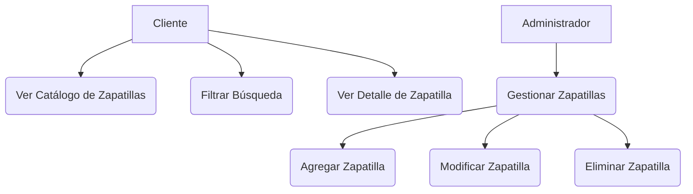

# Artefactos del Ciclo de Desarrollo de Software: Zapatillas J&R - Módulo de Catálogo

**Proyecto:** Zapatillas J&R - Tienda Online de Zapatillas
**Módulo a Desarrollar:** Gestión y Visualización del Catálogo de Productos (Zapatillas)
**Tecnología Seleccionada:** Web (Backend con Spring Boot y Java)

---

## 1. Historias de Usuario (User Stories)

Las siguientes historias de usuario definen la funcionalidad principal del módulo desde la perspectiva del usuario final (Cliente) y del personal de gestión (Administrador).

| ID | Rol | Funcionalidad | Propósito |
| :--- | :--- | :--- | :--- |
| HU-001 | Cliente | Ver un listado de zapatillas | Para poder encontrar el producto que busco. |
| HU-002 | Cliente | Filtrar las zapatillas por marca y talla | Para acotar mi búsqueda y ahorrar tiempo. |
| HU-003 | Cliente | Ver los detalles de una zapatilla | Para decidir si la compro, revisando descripción, precio e imágenes. |
| HU-004 | Administrador | Agregar una nueva zapatilla al catálogo | Para mantener el inventario y la oferta de productos actualizada. |
| HU-005 | Administrador | Modificar la información de una zapatilla existente | Para corregir errores, actualizar precios o cambiar el estado del stock. |

---

## 2. Diagrama de Casos de Uso (Resumen)

El diagrama de casos de uso se centra en las interacciones clave entre los actores y el sistema.

**Actores:**
*   **Cliente:** Usuario no autenticado o autenticado que navega por la tienda.
*   **Administrador:** Usuario autenticado con permisos para gestionar el catálogo.

**Casos de Uso:**
1.  **Ver Catálogo de Zapatillas:** Muestra la lista completa de productos.
2.  **Filtrar Búsqueda:** Permite aplicar criterios (marca, talla, precio) al catálogo.
3.  **Ver Detalle de Zapatilla:** Muestra la información completa de un producto específico.
4.  **Gestionar Zapatillas:** (Incluye Agregar, Modificar y Eliminar zapatillas).



---

## 3. Diagrama de Clases (Modelo de Datos y Lógica)

Este diagrama representa las clases principales del módulo de catálogo, siguiendo una arquitectura de capas típica de Spring Boot (Entidad, Repositorio, Controlador).

| Clase | Tipo | Responsabilidad | Atributos Clave |
| :--- | :--- | :--- | :--- |
| `Zapatilla` | Entidad (Modelo) | Representa un producto en la base de datos. | `id`, `nombre`, `marca`, `talla`, `precio`, `descripcion`, `stock` |
| `ZapatillaRepository` | Repositorio (DAO) | Interfaz para la persistencia de datos (CRUD). | Métodos de acceso a datos. |
| `ZapatillaService` | Servicio (Lógica de Negocio) | Contiene la lógica de negocio (filtrado, validación). | Métodos de negocio (e.g., `buscarPorMarca`, `guardar`). |
| `ZapatillaController` | Controlador (API Web) | Expone los endpoints REST para la gestión del catálogo. | Métodos HTTP (GET, POST, PUT, DELETE). |

```mermaid
classDiagram
    class Zapatilla {
        +Long id
        +String nombre
        +String marca
        +Integer talla
        +Double precio
        +String descripcion
        +Integer stock
    }

    class ZapatillaRepository {
        <<interface>>
        +Zapatilla findById(Long id)
        +List<Zapatilla> findAll()
        +Zapatilla save(Zapatilla zapatilla)
        +void deleteById(Long id)
    }

    class ZapatillaService {
        -ZapatillaRepository repository
        +List<Zapatilla> listarTodas()
        +Zapatilla buscarPorId(Long id)
        +List<Zapatilla> buscarPorMarcaYTalla(String marca, Integer talla)
        +Zapatilla guardar(Zapatilla zapatilla)
    }

    class ZapatillaController {
        -ZapatillaService service
        +GET /api/zapatillas
        +GET /api/zapatillas/{id}
        +POST /api/zapatillas
        +PUT /api/zapatillas/{id}
    }

    ZapatillaService "1" --o "1" ZapatillaRepository : usa
    ZapatillaController "1" --o "1" ZapatillaService : usa
    Zapatilla "1" <--o "*" ZapatillaRepository : gestiona
```

---

## 4. Informe Técnico y Plan de Trabajo

### 4.1. Tecnologías Seleccionadas

| Componente | Tecnología | Versión | Justificación |
| :--- | :--- | :--- | :--- |
| **Backend** | **Spring Boot** | 3.x (Java 17+) | Framework líder en Java para aplicaciones empresariales y microservicios. Facilita la creación de APIs REST robustas y escalables. |
| **Lenguaje** | **Java** | 17 | Lenguaje principal del componente formativo y estándar de la industria. |
| **Base de Datos** | **H2 Database** | Última | Base de datos en memoria para desarrollo y pruebas. Permite una configuración rápida y es ideal para un módulo *standalone*. Fácilmente reemplazable por PostgreSQL o MySQL en producción. |
| **Persistencia** | **Spring Data JPA** | 3.x | Abstracción para el acceso a datos, simplificando las operaciones CRUD. |
| **Versionamiento** | **Git** | N/A | Estándar de la industria para el control de versiones. Se creará un repositorio para el proyecto. |

### 4.2. Estándares de Codificación

El código fuente se adherirá a los siguientes estándares:

1.  **Nomenclatura Java:** Uso de *camelCase* para variables y métodos, *PascalCase* para clases e interfaces, y mayúsculas con guiones bajos (`SNAKE_CASE`) para constantes.
2.  **Comentarios:** Se utilizarán comentarios Javadoc para documentar clases, métodos y atributos, explicando su propósito, parámetros y valores de retorno.
3.  **Estructura:** Se seguirá la estructura de paquetes estándar de Spring Boot (`.controller`, `.service`, `.repository`, `.model`).
4.  **Inyección de Dependencias:** Se utilizará la inyección por constructor (`@RequiredArgsConstructor`) para asegurar la inmutabilidad y facilitar las pruebas unitarias.

### 4.3. Plan de Trabajo (Fases de Codificación)

| Fase | Tarea | Duración Estimada |
| :--- | :--- | :--- |
| **1. Inicialización** | Crear proyecto Spring Boot con dependencias (Web, JPA, H2). | 1 hora |
| **2. Modelo y Persistencia** | Codificar la entidad `Zapatilla` y la interfaz `ZapatillaRepository`. | 1 hora |
| **3. Lógica de Negocio** | Implementar la clase `ZapatillaService` con la lógica de negocio (CRUD y búsqueda). | 1 hora |
| **4. API REST** | Implementar `ZapatillaController` para exponer los endpoints REST. | 1 hora |
| **5. Pruebas y Documentación** | Añadir datos iniciales, probar la API y generar la documentación final. | 1 hora |

Este plan garantiza la entrega de un módulo funcional y bien estructurado, cumpliendo con todos los requisitos de la evidencia.
